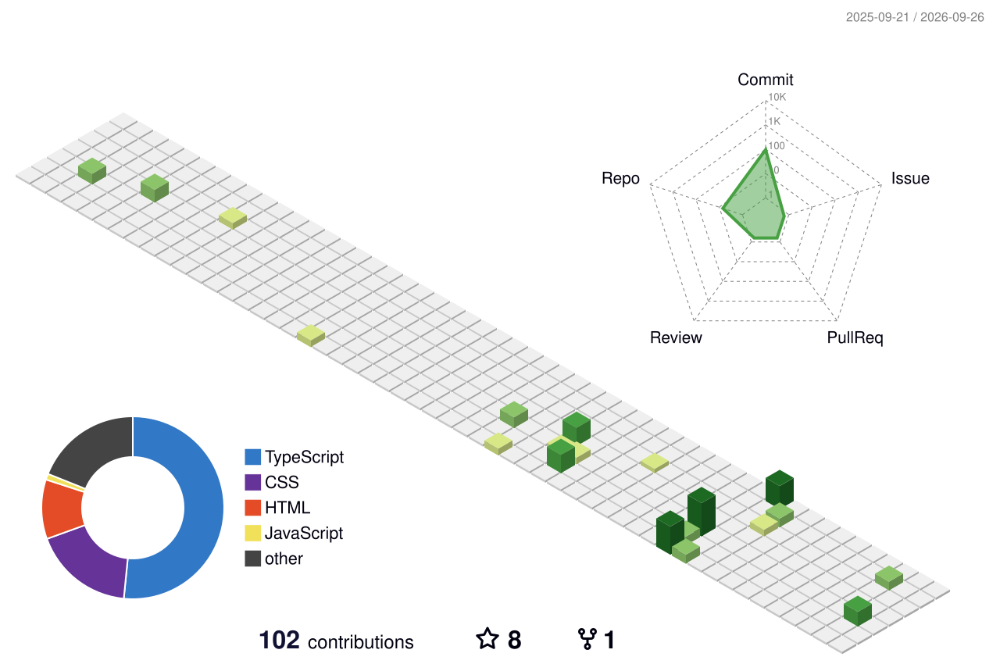

---

### About Me

Aspiring software developer based in Erfurt, Germany, focused on backend logic, clean architecture, and modern web technologies using **JavaScript, TypeScript, and Node.js**.

Currently preparing for dual vocational training (**Ausbildung zum Fachinformatiker für Anwendungsentwicklung**).

- **Technical Focus:** Server-side logic, RESTful APIs, and modular backend frameworks (**Express.js, NestJS**)
- **Languages:** German (B1 completed, advancing to B2), English (proficient in technical documentation), Ukrainian & Russian (native)
- **Contact:** [andriirebikov@gmail.com](mailto:andriirebikov@gmail.com)

---

### Tech Stack & Tools

  

- **Languages:** JavaScript (ES6+), TypeScript, HTML5, CSS3 / SCSS
- **Backend & APIs:** Node.js, Express.js, NestJS fundamentals, RESTful APIs
- **Storage & State:** LocalStorage, in-memory caching, relational and NoSQL database concepts
- **Tools & Workflow:** Git, GitHub, VS Code, Chrome DevTools, Postman

---

### Featured Projects

- **[GITFINDER](https://github.com/sputnikdark/GITFINDER)** – Dynamic web application for searching GitHub user profiles via the official REST API. Built with object-oriented JavaScript (ES6 classes), `async/await`, dynamic DOM manipulation, and robust error handling.
- **[Currency Converter](https://github.com/sputnikdark/currency-converter)** – Simple currency calculator with German interface. Fetches live rates via the ExchangeRate API using `async/await` and DOM events.
- **[TodoApp](https://github.com/sputnikdark/TodoApp)** – Interactive task manager with full state lifecycle management (add, complete, remove) and persistent client-side storage via `localStorage`.
- **[Quiz Game](https://github.com/sputnikdark/quiz-game)** – Interactive JavaScript quiz application with dynamic question flow and scoring logic.
- **[Color Palette Generator](https://github.com/sputnikdark/Color-Palette-Generator)** – Algorithmic color palette generator with clipboard copy integration.

---

### Contribution Activity

<picture>
  <source media="(prefers-color-scheme: dark)" srcset="profile-3d-contrib/profile-night-green.svg">
  <source media="(prefers-color-scheme: light)" srcset="profile-3d-contrib/profile-green-animate.svg">
  
</picture>

<picture>
  <source media="(prefers-color-scheme: dark)" srcset="github-snake-dark.svg">
  <source media="(prefers-color-scheme: light)" srcset="github-snake.svg">
  
</picture>
